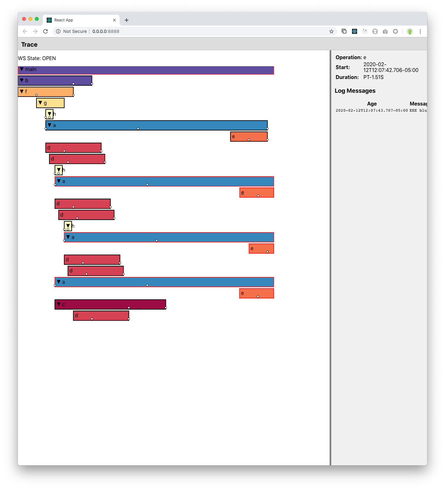

# Stdout-Trace

Ever been trying to debug a process with concurrent threads (such as a build, test run, or server)
by looking at logs, but been flummoxed by interleaved output from those threads? Wanted something
which would let you view the output from each thread independently while seeing how they overlap in
time, but without going to the trouble of hooking up a full-fledged tracing server like Zipkin
or Jaeger?

`stdout-trace` is designed to solve this problem. If your program logs simple trace events like
this: (TODO: write up spec)

```
$ go run examples/basic-goroutines/main.go
{"trace_evt":"start_span","id":1,"parent_id":-1,"ts":"2020-02-12T11:57:37.232418-05:00","op":"main"}
{"trace_evt":"start_span","id":2,"parent_id":1,"ts":"2020-02-12T11:57:37.232857-05:00","op":"b"}
{"trace_evt":"start_span","id":3,"parent_id":2,"ts":"2020-02-12T11:57:37.232905-05:00","op":"f"}
{"trace_evt":"log","id":3,"ts":"2020-02-12T11:57:38.236123-05:00","line":"FFF blurp"}
{"trace_evt":"start_span","id":4,"parent_id":3,"ts":"2020-02-12T11:57:38.236409-05:00","op":"g"}
{"trace_evt":"start_span","id":5,"parent_id":4,"ts":"2020-02-12T11:57:38.74152-05:00","op":"h"}
{"trace_evt":"finish_span","id":5,"ts":"2020-02-12T11:58:38.74152-05:00"}
```

...you can pipe them into `trace-format`, which will stream them out in a format that visualizes
the interleaving:

```
go run examples/basic-goroutines/main.go | trace-format
╷       start: main
├─┐     start: b
│ ├─┐   start: f
│ │ *   FFF blurp
│ │ ├─┐         start: g
│ │ │ ├─┐       start: h
│ │ │ │ *       h 0
│ │ │ │ ├─┐     start: a
│ │ │ │ │ *     AAA begin
│ │ │ │ ├─┼─┐   start: d
│ │ │ │ * │ │   h 1
│ │ │ │ ├─┼─┼─┐         start: d
│ │ │ │ X │ │ │         finish: h (404.478ms)
├─┼─┼─┼─┐ │ │ │         start: a
│ │ │ │ * │ │ │         AAA begin
├─┼─┼─┼─┼─┼─┼─┼─┐       start: c
│ │ │ ├─┼─┼─┼─┼─┼─┐     start: h
│ │ │ │ │ │ │ │ │ *     h 0
│ │ │ │ │ │ │ │ │ ├─┐   start: a
│ │ │ │ │ │ │ │ │ │ *   AAA begin
│ │ │ │ │ │ │ │ │ ├─┼─┐         start: d
│ │ │ │ │ │ │ │ │ * │ │         h 1
│ │ │ │ │ │ │ │ │ ├─┼─┼─┐       start: d
│ │ │ │ │ │ │ │ │ X │ │ │       finish: h (401.105ms)
│ │ │ │ │ │ * │ │   │ │ │       DDD blurp
│ │ │ X │ │ │ │ │   │ │ │       finish: g (1.508108s)
│ │ │ ╷ │ │ │ │ │   │ │ │       start: h
│ │ │ * │ │ │ │ │   │ │ │       h 0
│ │ │ ├─┼─┼─┼─┼─┼─┐ │ │ │       start: d
│ │ │ ├─┼─┼─┼─┼─┼─┼─┼─┼─┼─┐     start: a
│ │ │ │ │ │ │ │ │ │ │ │ │ *     AAA begin
│ │ │ │ │ │ │ * │ │ │ │ │ │     DDD blurp
│ │ │ * │ │ │ │ │ │ │ │ │ │     h 1
│ │ │ ├─┼─┼─┼─┼─┼─┼─┼─┼─┼─┼─┐   start: d
│ │ │ X │ │ │ │ │ │ │ │ │ │ │   finish: h (405.553ms)
│ │ │ ┌─┼─┼─┼─┼─┤ │ │ │ │ │ │   start: d
│ │ * │ │ │ │ │ │ │ │ │ │ │ │   FFF durp
│ │ X │ │ │ │ │ │ │ │ │ │ │ │   finish: f (3.009837s)
│ *   │ │ │ │ │ │ │ │ │ │ │ │   BBB sup
│ │   │ │ │ │ │ │ │ │ * │ │ │   DDD blurp
│ │   │ │ │ │ │ │ │ │ │ * │ │   DDD blurp
│ │   │ │ │ │ │ │ * │ │ │ │ │   DDD blurp
│ │   │ │ │ │ │ │ │ │ │ │ │ *   DDD blurp
│ │   * │ │ │ │ │ │ │ │ │ │ │   DDD blurp
│ *   │ │ │ │ │ │ │ │ │ │ │ │   BBB yo
│ X   │ │ │ │ │ │ │ │ │ │ │ │   finish: b (4.011814s)
│     │ │ │ * │ │ │ │ │ │ │ │   DDD durp
│     │ │ │ X │ │ │ │ │ │ │ │   finish: d (3.000788s)
│     │ │ │   * │ │ │ │ │ │ │   DDD durp
│     │ │ │   X │ │ │ │ │ │ │   finish: d (3.003583s) 
```

Event streams can also be piped into trace-ui, which looks like this:

```
go run examples/basic-goroutines/main.go | trace-ui
```



A stdout stream of trace events can also be saved to a file and replayed later, as is the Unix way :)
